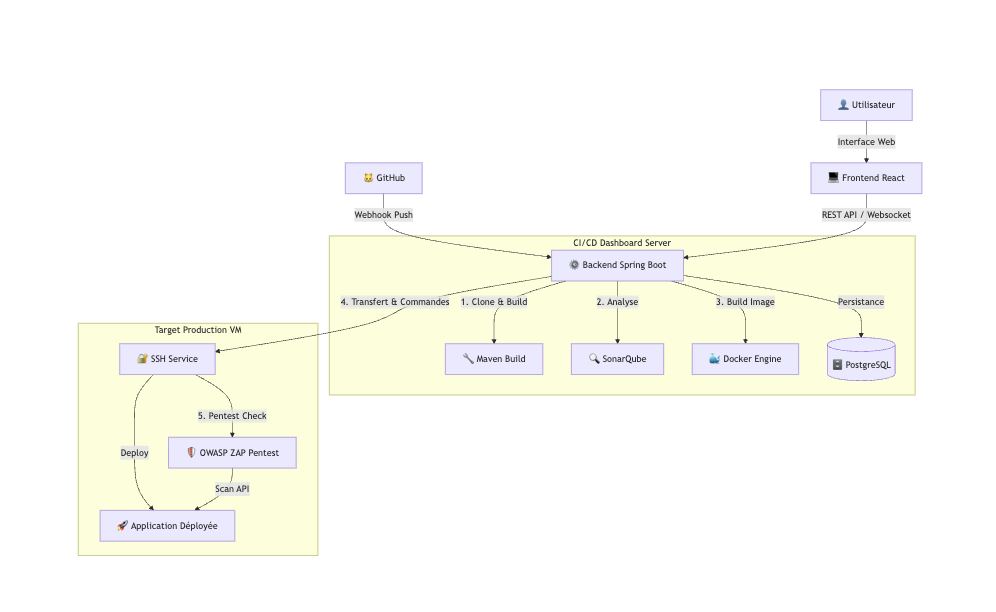
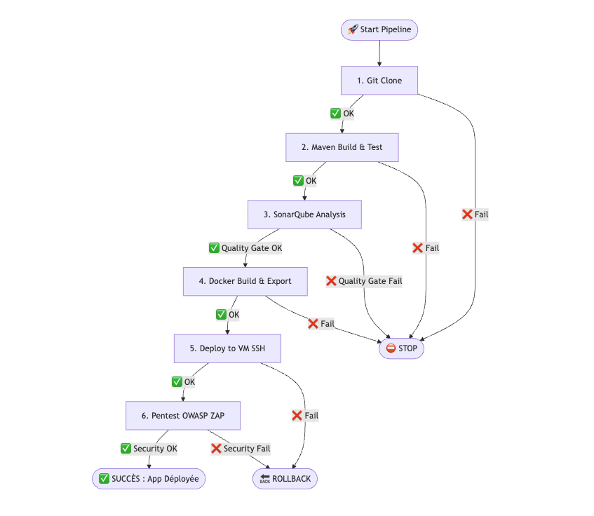

# 🚀 CI/CD Dashboard — Plateforme de Déploiement Simplifiée

[](https://www.oracle.com/java/)
[](https://spring.io/projects/spring-boot)
[](#)
[](https://react.dev/)
[](#)
[](https://www.docker.com/)
[](https://www.sonarqube.org/)

---

## 📋 Description

Ce projet est un **Dashboard CI/CD unifié** permettant de surveiller la qualité du code (via SonarQube) et de gérer les déploiements d'applications sur des environnements distants (VM).
Il permet de déployer ce projet d'[architecture logiciel](https://github.com/Deeffault/IMT-Architecture-Logiciel) sur une VM linux simulant un serveur de production.

Il combine :
- Un **Backend Spring Boot** qui orchestre les déploiements via SSH et Docker.
- Un **Frontend React** moderne pour visualiser l'état des pipelines et la qualité du code.
- Une stack **Docker complète** incluant SonarQube et PostgreSQL.

---

## 🛠️ Prérequis & Installation de l'Environnement

Ce guide suppose que vous déployez l'application sur une machine Linux vierge (ou une VM).

### 1. Création de la Machine Virtuelle (VM)

Si vous êtes sur macOS (Apple Silicon ou Intel), nous recommandons **UTM**. Sur Windows/Linux, **VirtualBox**.

1.  Téléchargez l'image ISO de **Ubuntu Server** (version ARM64 pour Mac M1/M2/M3, AMD64 pour intel) :
    [📥 Télécharger Ubuntu Server](https://ubuntu.com/download/server#architectures)
2.  Créez une nouvelle VM avec au moins :
    *   **4 Go de RAM**
    *   **20 Go de disque**.

### 2. Accès SSH

Une fois la VM installée, connectez-vous et installez le serveur OpenSSH (souvent proposé à l'installation d'Ubuntu).

```bash
sudo apt update
sudo apt install openssh-server
```

Configurez une paire de clés SSH pour permettre au Dashboard de se connecter à la VM (ou à d'autres serveurs) :

```bash
# Générer une clé SSH (validez les options par défaut avec Entrée, laissez la passphrase vide)
ssh-keygen -m PEM -t rsa -b 4096 -f ~/.ssh/id_rsa_projet -N ""

# Ajouter la clé publique aux clés autorisées (pour se connecter à soi-même ou à la cible)
cat ~/.ssh/id_rsa_projet.pub >> ~/.ssh/authorized_keys
```

*(Note : Si vous déployez sur une machine distante différente, utilisez `ssh-copy-id -i ~/.ssh/id_rsa_projet.pub user@host`)*

### 3. Installation de Docker

Suivez la documentation officielle pour installer Docker sur Ubuntu :
[📖 Guide d'installation Docker Ubuntu](https://docs.docker.com/engine/install/ubuntu/)

**Élévation de privilèges** (pour ne pas utiliser `sudo` avec Docker) :

```bash
sudo usermod -aG docker $USER
# Appliquer les changements (ou redémarrez la session)
newgrp docker
```
---

## 🚀 Configuration & Démarrage

### 1. Récupération du projet

Clonez le repo sur la VM :

```bash
git clone https://github.com/axel-lexa/imt-projet-cloud-securise.git dashboard
cd dashboard
```

### 2. Configuration (`.env`)

L'application nécessite des variables d'environnement. Créez un fichier `.env` à la racine :

```bash
copy .env.example .env
```

### 3. Lancement

```bash
docker compose up -d --build
```

L'application va :
1.  Construire le Frontend (Vite/React).
2.  Construire le Backend (Maven/Spring).
3.  Lancer la base de données PostgreSQL.
4.  Lancer SonarQube.


Si vous voulez utiliser la fonctionnalité de deploiement via Webhooks, vous devez installer ngrok sur votre machine hôte (pas la VM) et exposer le port 8081 :

```bash
ngrok http 8081
```
---

## 🖥️ Utilisation

### Accès aux services

| Service | URL (Host) | URL (VM) | Identifiants par défaut |
|---------|------------|----------|-------------------------|
| **Dashboard** | [http://localhost:8081](http://localhost:8081) | http://ip-vm:8081 | Login via GitHub |
| **SonarQube** | [http://localhost:9000](http://localhost:9000) | http://ip-vm:9000 | `admin` / `admin` |

### Configuration SonarQube

1.  Accédez à [http://localhost:9000](http://localhost:9000).
2.  Connectez-vous avec `admin` / `admin`.
3.  Changez le mot de passe pour `admin123` (requis par la configuration par défaut du dashboard).

Votre dashboard est maintenant prêt à analyser vos projets et gérer vos déploiements ! 🚀

## 🏗️ Architecture et Fonctionnement

### Schéma Global

L'application repose sur une architecture centralisée où le Dashboard orchestre l'ensemble du cycle de vie CI/CD.



### Fonctionnement du Pipeline (Workflow)

Le pipeline est **séquentiel**. Si une étape échoue, le processus s'arrête immédiatement pour garantir la sécurité et la stabilité (**Fail-Fast**).



**Détails des étapes :**

1.  **Récupération du Code** : Clone du dépôt Git (URL ou Webhook).
2.  **Compilation & Tests** : Compilation Java et tests unitaires (`mvn clean package`).
3.  **Analyse Qualité** : Analyse **SonarQube**. Si le "Quality Gate" échoue (bugs, failles), le pipeline s'arrête.
4.  **Conteneurisation** : Construction et export de l'image Docker (`docker build`, `docker save`).
5.  **Déploiement Continu** : Transfert vers la VM (SSH/SCP), chargement de l'image et redémarrage du conteneur.
6.  **Pentest (Test d'intrusion)** : L'outil **OWASP ZAP** est lancé sur la VM pour scanner l'API déployée. Si des failles critiques sont trouvées, le déploiement est annulé (**Auto-Rollback**).

Ce processus garantit que seul du code fonctionnel et sécurisé est maintenu en production.
